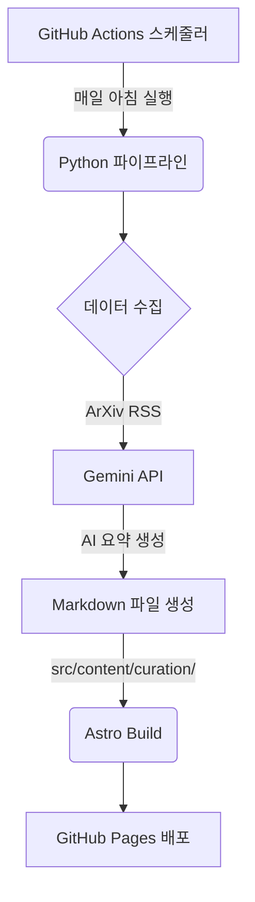

# 🤖 AI Curator (jwsung91/ai-curator)

AI가 매일 기술 소식을 수집하고 요약하여 정적 사이트로 배포하는 **Serverless Static Curation System**입니다.

## 🏗️ 전체 아키텍처

본 프로젝트는 **Python 기반 데이터 파이프라인**과 **Astro(SSG) 프론트엔드**가 결합된 구조로, GitHub Actions를 통해 100% 자동화되어 운영됩니다.



## 📂 프로젝트 구조

```text
ai-curator/
├── .github/workflows/
│   └── deploy.yml           # 매일 아침 자동 실행 및 배포 스케줄러
├── scripts/                 # 데이터 파이프라인 (Python)
│   ├── main.py              # 파이프라인 실행 진입점
│   ├── fetcher.py           # 데이터 수집 로직 (ArXiv RSS 등)
│   ├── builder.py           # Gemini API 연동 및 마크다운 생성
│   └── requirements.txt     # Python 의존성 (google-genai, feedparser 등)
├── src/
│   ├── content/
│   │   └── curation/        # [자동 생성] AI가 작성한 마크다운 저장소
│   ├── pages/               # Astro 페이지 컴포넌트
│   │   ├── index.astro      # 큐레이션 리스트 페이지
│   │   └── curation/[id].astro # 리포트 상세 페이지
│   └── content.config.ts    # 컨텐츠 스키마 정의 (Zod)
├── tests/                   # 파이프라인 유닛 테스트
│   └── test_pipeline.py     # pytest를 이용한 수집/요약/저장 테스트
├── package.json             # Node.js 의존성 및 스크립트
└── astro.config.mjs         # Astro 설정 파일
```

## 🚀 주요 기능 및 구현 상세

### 1. 데이터 파이프라인 (Python)
- **수집 (`fetcher.py`)**: `feedparser`를 사용하여 ArXiv(AI/ML)의 최신 논문 5개를 수집합니다.
- **요약 (`builder.py`)**: Google의 최신 **`google-genai` SDK**를 사용하여 `gemini-1.5-flash` 모델에게 한국어 제목과 요약을 요청합니다.
- **포맷팅**: Astro의 Content Collections 규격에 맞춰 **Frontmatter**가 포함된 마크다운 파일(`YYYY-MM-DD-daily.md`)을 생성합니다.

### 2. 프론트엔드 (Astro)
- **테마**: `zinc/blue` 계열의 모던한 디자인과 시스템 설정 연동 다크모드를 지원합니다.
- **자동 라우팅**: `src/content/curation/`에 파일이 추가되면 빌드 시 자동으로 새로운 페이지가 생성됩니다.
- **스타일링**: Tailwind CSS 및 `@tailwindcss/typography`를 사용하여 AI가 작성한 마크다운 본문을 미려하게 렌더링합니다.

### 3. 자동화 워크플로우 (GitHub Actions)
- **스케줄링**: 매일 KST 10:00에 실행됩니다.
- **자동 커밋**: 파이프라인이 생성한 마크다운 파일을 `git-auto-commit-action`을 통해 레포지토리에 자동으로 반영합니다.

## 🛠️ 개발 및 로컬 테스트

### 파이프라인 테스트 (Python)
```bash
# 가상환경 구축 및 패키지 설치
python3 -m venv .venv
source .venv/bin/activate
pip install -r scripts/requirements.txt pytest pytest-mock

# 테스트 실행
pytest tests/

# 수동 파이프라인 실행 (GEMINI_API_KEY 필요)
export GEMINI_API_KEY=your_key_here
python scripts/main.py
```

### 프론트엔드 실행 (Node.js)
```bash
npm install
npm run dev
```

## 🔑 환경 변수
GitHub Actions 작동을 위해 아래의 Secret 등록이 필요합니다.
- `GEMINI_API_KEY`: Google AI Studio에서 발급받은 API 키
